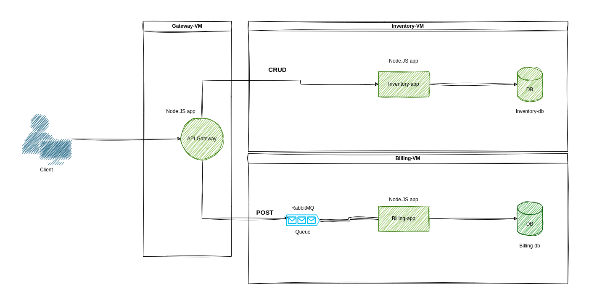

# Crud-master

A simple microservice infrastructure havig an API Gateway to two services, the inventory API that allows users to browse available movies and the billing API that processes messages received through RabbitMQ.

## Architecture Overview

This project implements a microservices architecture with three main components:

1. **API Gateway**: Acts as the entry point for all client requests, routing them to the appropriate service.
2. **Inventory Service**: Manages the movie catalog with CRUD operations.
3. **Billing Service**: Handles payment processing using a message queue.



## Technologies Used

- **Vagrant**: For environment management
- **Virtual Box**: For virtualization
- **Node.js & Express**: Backend framework for all services
- **PostgreSQL**: Database for persistent storage
- **Sequelize**: ORM for database interactions
- **RabbitMQ**: Message broker for asynchronous communication between services

## Project Setup

### Prerequisites

- Vagrant
- Virtualbox (or another virtualization software compatible with vagrant and the boxes)
- Postman (in order to test the api)
### Setting Up the Environment

1. Clone the repository:
   ```bash
   git clone https://learn.zone01dakar.sn/git/iyossang/crud-master.git
   cd crud-master
   ```

2. Start the virtual machines:
   ```bash
   vagrant up
   ```

3. SSH into each VM to set up the individual services if needed:
   ```bash
   vagrant ssh gateway-vm
   vagrant ssh inventory-vm
   vagrant ssh billing-vm
   ```

## API Documentation

#### Movies

- **GET /api/inventory**: Retrieve all movies
- **GET /api/inventory/:id**: Retrieve a movie by ID
- **POST /api/inventory**: Create a new movie
  ```json
  {
    "title": "The Matrix",
    "description": "A computer hacker learns about the true nature of reality",
  }
  ```
- **PUT /api/inventory/:id**: Update a movie
- **DELETE /api/inventory**: Delete all movies
- **DELETE /api/inventory/:id**: Delete a movie


#### Billing

- **All Inventory Service endpoints**: Proxied through the gateway
- **POST /api/billing**: Send a billing request
  ```json
  {
    "userId": 20,
    "number_of_items": 99,
    "total_amount": 250
  }
  ```

## How It Works

1. Clients send requests to the API Gateway.
2. For inventory operations, the gateway forwards HTTP requests to the Inventory Service.
3. For billing operations:
   - The gateway sends a message to RabbitMQ queue.
   - The Billing Service consumes messages from the queue and processes payments asynchronously.
   - Payment results are stored in the billing database.


### Testing with Postman

1. Import the provided Postman collection `crud_master.postman_collection.json`.
2. Set up environment variables for your VMs' IP addresses.
3. Execute the requests to test different endpoints.
